## Camera-LiDAR-Calibration 매뉴얼 (ROS 2)

> **참고:** 이 프로젝트는 [Livox-SDK/livox_camera_lidar_calibration](https://github.com/Livox-SDK/livox_camera_lidar_calibration)의 ROS 1 원본 저장소를 기반으로, **Ubuntu 22.04 및 ROS 2 Humble** 환경에서 빌드 및 실행할 수 있도록 마이그레이션된 버전입니다.

이 솔루션은 Livox LiDAR와 카메라 간의 외부 파라미터(Extrinsic parameters)를 수동으로 캘리브레이션하는 방법을 제공하며, Mid-40, Horizon, Tele-15 시리즈 등에서 검증되었습니다. 이 패키지는 카메라 내부 파라미터(Intrinsic parameters) 캘리브레이션, 캘리브레이션 데이터 획득, 카메라와 LiDAR 간의 외부 파라미터 계산, 그리고 카메라-LiDAR 융합 애플리케이션 예제를 포함합니다. 
본 솔루션에서는 보드의 모서리(corner)를 캘리브레이션 타겟으로 사용합니다. Livox LiDAR의 비반복적 스캐닝 특성 덕분에 고밀도 점군(Point cloud)에서 모서리의 정확한 위치를 보다 쉽게 찾을 수 있으며, 이를 통해 더 나은 캘리브레이션 결과와 융합 결과를 얻을 수 있습니다.

내부 파라미터 및 외부 파라미터 캘리브레이션에 사용되는 데이터 예제는 아래 링크에서 다운로드할 수 있습니다. 데이터는 이미 기본 경로에 맞게 구성되어 있습니다.

[데이터 예제 다운로드](https://terra-1-g.djicdn.com/65c028cd298f4669a7f0e40e50ba1131/Download/update/data.zip)

### 1단계: 환경 구성

(다음 캘리브레이션 과정은 Ubuntu 22.04 64-bit 및 ROS 2 Humble 환경을 기준으로 합니다.)

#### 1.1 환경 및 드라이버 설치

ROS 2 환경을 설치하고, Livox SDK2 및 [livox_ros_driver2](https://github.com/Livox-SDK/livox_ros_driver2)를 설치합니다. 이미 설치되어 있다면 이 단계를 건너뛸 수 있습니다.

```bash
# Livox-SDK2 설치 (ROS 2 드라이버의 종속성)
git clone https://github.com/Livox-SDK/Livox-SDK2.git
cd Livox-SDK2
mkdir build && cd build
cmake .. && make -j
sudo make install

# livox_ros_driver2 설치
cd ~
mkdir -p ws_livox/src
cd ws_livox/src
git clone https://github.com/Livox-SDK/livox_ros_driver2.git
cd ..
colcon build --symlink-install
```

#### 1.2 의존성 설치

이미 설치되어 있다면 이 단계를 건너뛸 수 있습니다. ROS 2 전용 패키지를 함께 설치해야 합니다.

```bash
sudo apt update
sudo apt install libpcl-dev libopencv-dev libceres-dev
sudo apt install ros-humble-pcl-conversions ros-humble-pcl-ros ros-humble-cv-bridge ros-humble-rosbag2-cpp
```

#### 1.3 소스 코드 다운로드 및 컴파일

```bash
# 워크스페이스의 src 디렉터리로 이동하여 카메라-라이다 캘리브레이션 패키지 설치
cd ~/ws_livox/src
# (이 ROS 2 마이그레이션 코드가 포함된 레포지토리를 클론합니다)
git clone <ROS2_마이그레이션된_레포지토리_URL> camera_lidar_calibration
cd ~/ws_livox
colcon build --packages-select camera_lidar_calibration
source install/setup.bash
```

#### 1.4 프로그램 노드 요약

이 프로젝트에는 다음 노드들이 포함되어 있습니다:

- `cameraCalib` - 카메라 내부 파라미터 캘리브레이션
- `pcdTransfer` - LiDAR ROS 2 bag(.db3)을 PCD 파일로 변환
- `cornerPhoto` - 사진에서 캘리브레이션 보드 모서리 좌표 획득
- `getExt1` - 외부 파라미터 계산 노드 1 (외부파라미터터만 최적화)
- `getExt2` - 외부 파라미터 계산 노드 2 (내부 파라미터와 외부파라미터터를 함께 최적화)
- `projectCloud` - 사진 위에 LiDAR 점군 투영
- `colorLidar` - LiDAR 점군에 색상 입히기 (Colorize)

launch 파일의 설정을 수정하려면 `launch/` 폴더 안의 Python launch 파일(`.launch.py`)을 수정하시면 됩니다.

### 2단계: 카메라 내부 파라미터 캘리브레이션

#### 2.1 사전 준비

캘리브레이션 체스보드를 준비합니다 (아래와 같은 형태를 출력하여 사용).

<div align=center>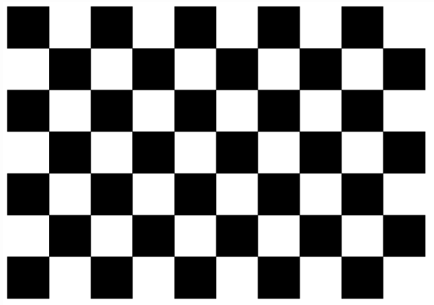</div>

MATLAB을 사용하여 내부 파라미터를 계산하거나, 제공되는 `cameraCalib` 노드를 사용할 수 있습니다.

**파라미터 조정**

사용할 카메라가 핀홀(Pinhole) 이미징 모델을 따르는지 확인하세요. 먼저 초점 및 사진 해상도 등 카메라 자체의 기본 매개변수를 조정합니다. 본 예시에서는 Livox Horizon LiDAR와 Hikvision 산업용 카메라를 사용합니다. 사진의 시야각(FOV)과 LiDAR 점군의 시야각이 일치하도록 LiDAR의 FOV에 맞춰 사진 해상도를 조정해야 합니다. (Horizon의 FOV는 가로 81.7 x 세로 25.1도 이므로 해상도를 1520x568 픽셀로 설정했습니다.)

<div align=center>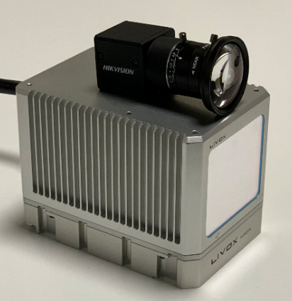</div>

#### 2.2 MATLAB 캘리브레이션 (선택 사항)

이 방법은 MATLAB 설치가 필요합니다. MATLAB을 사용하지 않으려면 2.3절의 ROS 노드를 참조하세요.

전체 시야각을 덮을 수 있도록 최소 20장 이상의 체스보드 사진을 준비합니다. 더 나은 결과를 얻으려면 촬영 시 약 3미터의 거리를 유지하세요.

<div align=center>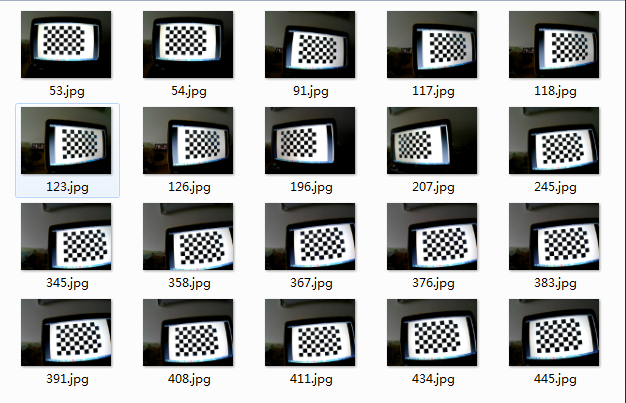</div>

MATLAB의 "cameraCalibrator" 도구를 사용하면 다음과 같은 결과를 얻을 수 있으며, 여기서 필요한 데이터는 방사상 왜곡(Radial Distortion), 접선 왜곡(Tangential Distortion) 및 내부 파라미터 행렬(Intrinsic Matrix)입니다.

<div align=center>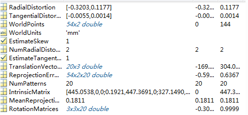</div>

#### 2.3 cameraCalib 노드 캘리브레이션

(2.2의 MATLAB을 사용했다면 이 단계를 건너뛸 수 있습니다.)

사진 데이터를 얻은 후 `cameraCalib.launch.py` (또는 해당 파이썬 launch 파일) 내에 경로와 파라미터를 구성합니다. 기본적으로 사진 데이터를 `data/camera/photos` 아래에 넣고, `data/camera/in.txt`에 해당 사진 이름들을 적습니다.

<div align=center>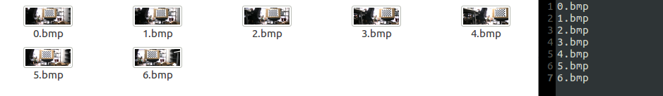</div>

다음 명령어를 실행하여 캘리브레이션을 시작합니다:

```bash
ros2 launch camera_lidar_calibration cameraCalib.launch.py
```

캘리브레이션 결과는 재투영 오차, 내부 파라미터 및 왜곡 보정 파라미터와 함께 `data/camera/result.txt`에 저장됩니다.

#### 2.4 캘리브레이션 결과 데이터

1. 3x3 내부 파라미터 행렬 (IntrinsicMatrix) [[참고 1]](#참조)
2. 5개의 왜곡 보정 파라미터: k1, k2, p1, p2, k3

### 3단계: 캘리브레이션 씬 준비 및 데이터 수집

#### 3.1 캘리브레이션 씬 준비

이 프로젝트에서는 캘리브레이션 보드의 4개 모서리를 타겟 포인트로 사용합니다 [[참고 2]](#참조). 타겟 보드를 잘 식별하고 LiDAR와 보드 간의 거리를 확보하기 위해 비교적 비어있는 넓은 공간을 선택하는 것이 좋습니다. 본 예제에서는 저반사 폼으로 만든 1x1.5m 캘리브레이션 보드를 사용합니다. 정확도를 높이기 위해 최소 3미터 이상 떨어진 곳에서 약 10개 이상의 다양한 각도와 위치에 보드를 배치하며 데이터를 수집해야 합니다 [[참고 3]](#참조).

<div align=center>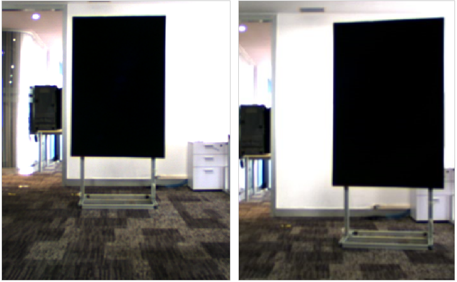</div>
<div align=center>다양한 위치와 각도에 캘리브레이션 보드 배치</div>

#### 3.2 LiDAR 연결

LiDAR를 연결하고 점군(Point Cloud) 데이터 상에서 보드의 모서리가 명확하게 보이는지 확인합니다. ROS 2 드라이버를 통해 rviz에서 데이터를 시각화할 수 있습니다.

데이터 기록을 진행할 때 다음 명령어를 사용해 ROS 2 bag 파일을 저장합니다.

**주의**: 나중에 사용될 코드는 `livox_ros_driver2/msg/CustomMsg` 포맷의 메시지가 필요합니다. ROS 2 환경의 Livox 드라이버 설정이 이 CustomMsg를 출력하도록 설정되어 있는지 확인하세요.

#### 3.3 카메라 연결

카메라 구동 소프트웨어(예: MVS)를 사용하여 카메라를 연결하고 사진 품질과 사진 상의 보드 모서리가 잘 식별되는지 확인합니다.

#### 3.4 데이터 수집 (사진 및 LiDAR)

1. 보드가 위치한 사진을 촬영하여 저장합니다.
2. 아래 명령어를 사용해 LiDAR 점군 데이터를 기록합니다.

```bash
ros2 bag record /livox/lidar
```

3. 각 배치 위치마다 사진 1장과 약 10초 길이의 ros2 bag 데이터를 저장합니다.
4. 수집 완료 후, 사진은 `data/photo` 폴더에, LiDAR bag 파일은 `data/lidar` 폴더에 배치합니다.

### 4단계: 캘리브레이션 데이터 획득

#### 4.1 파라미터 세팅

2단계에서 구한 내부 파라미터 및 왜곡 파라미터를 `data/parameters/intrinsic.txt` 파일에 저장합니다 [[참고 4]](#참조). 왜곡 파라미터는 차례대로 k1, k2, p1, p2, k3 이며, 보통 k3은 0으로 둡니다.

<div align=center>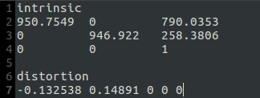</div>

#### 4.2 사진에서 모서리 좌표 획득

1. `cornerPhoto.launch.py` 런치 파일 내의 경로를 알맞게 수정한 후 실행합니다:

```bash
ros2 launch camera_lidar_calibration cornerPhoto.launch.py
```

2. 프로그램이 왜곡이 보정된 사진을 엽니다 [[참고 5]](#참조). 캘리브레이션 보드의 각 모서리 위로 마우스를 올리면 창의 왼쪽 하단에 좌표 데이터가 표시됩니다. **왼쪽 위 모서리부터 시작하여 반시계 방향**으로 4개의 모서리 좌표를 메모해 둡니다.

<div align=center>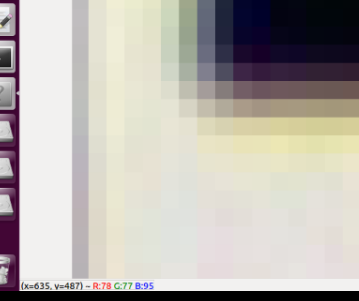</div>

3. 화면을 클릭하고 아무 키나 누르면 터미널에서 좌표를 입력하는 상태로 전환됩니다. 메모해둔 네 모서리의 좌표 "x y"를 순서대로 입력합니다 (x와 y 사이에 공백 하나. 예: `635 487`). 모두 입력 후 `0 0`을 입력하면 입력 프로세스가 종료됩니다. 프로그램은 서브픽셀 정밀도를 계산하여 `data/corner_photo.txt`에 저장합니다. 아무 키나 눌러 창을 닫습니다.

<div align=center>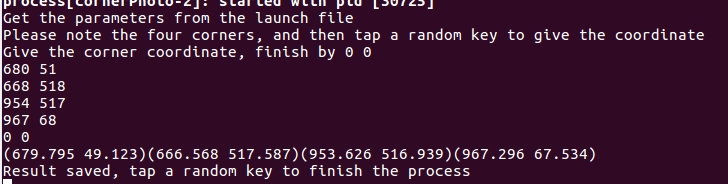</div>

4. launch 파일에서 사진 경로를 변경해가며, 수집한 모든 사진에 대해 모서리 좌표 획득 과정을 반복합니다.

#### 4.3 점군(Point Cloud)에서 모서리 좌표 획득

1. `pcdTransfer.launch.py` 파일의 bag 경로를 확인하고 0.bag, 1.bag 처럼 데이터 번호를 맞춰줍니다. (ROS 2 bag 폴더 형식을 따릅니다.)

2. 다음 명령어를 실행하여 ROS 2 bag 파일들을 PCD 파일로 일괄 변환합니다. 변환된 PCD는 기본적으로 `data/pcdFiles`에 저장됩니다.

```bash
ros2 launch camera_lidar_calibration pcdTransfer.launch.py
```

3. PCL 뷰어를 사용하여 PCD 파일을 열고, Shift 키를 누른 상태에서 보드 모서리를 클릭(좌클릭)하여 좌표를 얻습니다 [[참고 6]](#참조). **사진에서 좌표를 딴 순서(반시계 방향)와 동일한 순서**로 점을 선택해야 합니다.

```bash
pcl_viewer -use_point_picking xx.pcd
```

4. 모든 PCD 파일에 대해 획득한 X, Y, Z 좌표를 다음 포맷에 맞춰 `data/corner_lidar.txt` 에 저장합니다.

<div align=center>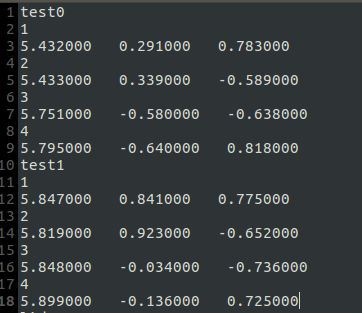</div>

(pcl_viewer 외에 본인에게 익숙한 다른 3D 점군 시각화 도구를 사용해도 무방합니다.)

### 5단계: 외부 파라미터 계산

#### 5.1 데이터 파일 준비

외부 파라미터 계산 노드는 `data/corner_photo.txt`와 `data/corner_lidar.txt`를 읽어들입니다. 이 데이터는 올바르게 파싱되기 위해 특정 포맷을 유지해야 합니다. 한 줄의 길이가 10자 이상인 데이터만 좌표로 인식하며, 짧은 텍스트("1 2 3 4", "lidar0" 등)는 무시됩니다. 프로그램은 빈 줄을 만나면 데이터 읽기를 중단하고 계산을 시작합니다.

<div align=center>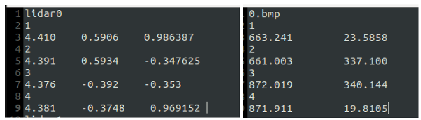</div>

계산 전에 두 파일(사진/LiDAR)의 데이터 줄 수와 모서리 매칭 순서가 정확히 일치하는지 확인하세요 [[참고 7]](#참조).

#### 5.2 계산 노드 실행 (getExt1)

먼저 `getExt1.launch.py` 파일 내에 외부 파라미터 초기값을 적절히 설정합니다 [[참고 8]](#참조). 그런 다음 아래 명령어로 외부 파라미터 최적화를 수행합니다.

```bash
ros2 launch camera_lidar_calibration getExt1.launch.py
```

반복(Iteration) 비용(cost)이 터미널에 출력되며, 계산 결과는 `data/parameters/extrinsic.txt` 경로에 동차 변환 행렬(Homogeneous Matrix) 형식으로 저장됩니다.

<div align=center>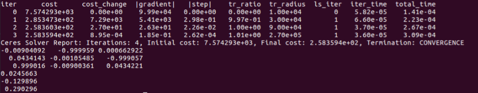</div>

최적화 Cost와 재투영 오차(Reprojection Error)를 통해 얻어진 외부파라미터터를 평가할 수 있습니다 [[참고 9]](#참조). 
오차가 큰 데이터가 터미널에 출력되면 해당 데이터를 아웃라이어(Outlier)로 제거한 뒤 다시 계산해 봅니다.

#### 5.3 계산 노드 실행 (getExt2)

`getExt1` 노드는 외부파라미터터만 최적화하는 반면, `getExt2` 노드는 내부 파라미터와 외부파라미터터를 동시에 함께 최적화합니다.

```bash
ros2 launch camera_lidar_calibration getExt2.launch.py
```

일반적으로 `getExt1`만으로 충분히 좋은 결과를 얻을 수 있습니다. 하지만 이상치(Outlier)를 제거했음에도 불구하고 초기값 대비 Cost가 여전히 높게 나온다면 `getExt2`를 시도해 볼 수 있습니다. (이 노드를 사용하려면 데이터 양이 충분히 많아야 합니다.) 

`getExt2`의 결과가 더 좋다면, 새로 출력된 내부 파라미터 파라미터로 `data/parameters/intrinsic.txt`를 업데이트 하세요.

### 6단계: 결과 검증 및 응용 애플리케이션

#### 6.1 개요

외부파라미터터를 획득한 후 융합 결과를 시각적으로 확인하기 위해 두 가지 일반적인 애플리케이션을 제공합니다. 첫 번째는 사진 위에 점군을 투영(Projection)하는 것이고, 두 번째는 3D 점군 데이터에 색상을 입히는(Colorize) 것입니다 [[참고 10]](#참조).

#### 6.2 사진 위에 점군 투영 (Projection)

`projectCloud.launch.py` 파일 내에 bag 데이터와 사진 경로를 설정한 후, 명령어를 실행하여 점군을 사진 위에 투영합니다.

```bash
ros2 launch camera_lidar_calibration projectCloud.launch.py
```

<div align=center>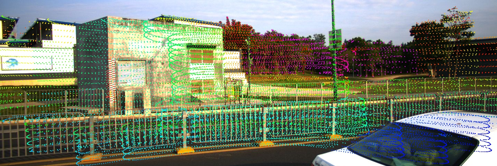</div>
<div align=center>사진 투영 결과</div>

#### 6.3 점군 컬러화 (Point cloud coloring)

`colorLidar.launch.py` 내의 경로를 알맞게 설정하고, 노드를 실행한 뒤 RViz에서 컬러 렌더링 결과를 확인합니다.

```bash
ros2 launch camera_lidar_calibration colorLidar.launch.py
```

<div align=center>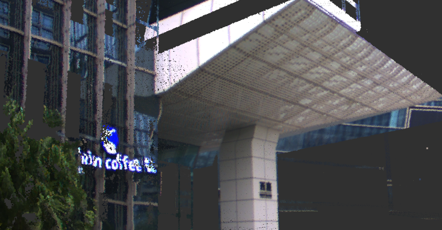</div>
<div align=center>컬러링 렌더링 결과</div>

### 참조 (Notes)

1. 내부 파라미터 행렬의 형식은 다음 그림과 같습니다. 일반적으로 행렬의 4개 위치 (0,0); (0,2); (1,1); (1,2)에 값이 존재합니다.
   <div align=center>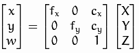</div>
2. 캘리브레이션의 기본 원리는 동일한 타겟에 대해 LiDAR 좌표계의 xyz 좌표와 카메라 좌표계의 xy 좌표 간의 변환 관계를 계산하는 것입니다. 점군과 사진 양쪽에서 모두 모서리가 비교적 식별하기 명확하기 때문에 이 방법은 캘리브레이션 오차를 줄이는 데 도움이 됩니다.
3. 다수의 캘리브레이션 보드나 LiDAR가 인식할 수 있는 특수한 체스보드를 사용하는 것도 가능합니다.
4. 포맷을 변경하지 않도록 주의하세요. 형식을 바꾸면 프로그램 내 `common.h`의 `getIntrinsic()` 및 `getDistortion()` 함수 코드도 함께 수정해야 합니다.
5. 화면에 표시되는 사진은 왜곡 파라미터가 보정된 사진입니다. 이미지 보정이 정상적으로 이루어졌는지 육안으로 확인하세요. 예를 들어, 아래 그림의 왼쪽 사진처럼 비정상적이라면 왜곡 파라미터가 잘못 설정된 것일 수 있습니다 (오른쪽 사진이 정상).
   <div align=center>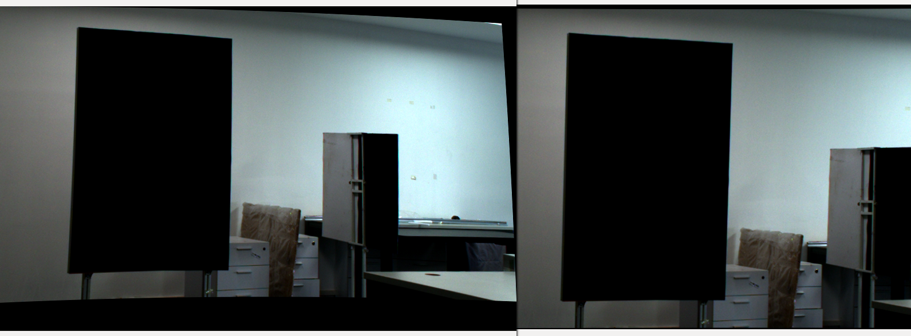</div>
6. `pcl_viewer`를 연 상태에서 터미널에 "h"를 입력하면 단축키 등 사용 가이드를 볼 수 있습니다.
7. 텍스트 데이터의 한 줄 길이가 10자를 넘지 않으면 읽히지 않습니다. 점군 xyz 또는 사진 xy 좌표 텍스트가 너무 짧을 경우, 소수점이나 공백을 추가하여 10자를 넘겨주어야 합니다.
8. 프로그램 내부의 기본 초기값은 Livox LiDAR의 좌표계, 그리고 LiDAR와 카메라의 일반적인 장착 위치를 가정하여 설정되어 있습니다. 실제 장착 환경에 맞게 `launch` 파일에서 초기값을 수정해야 합니다. 초기값이 너무 벗어난 상태면 최적화 실패의 원인이 될 수 있습니다.
9. 이터레이션(Iteration)이 끝났는데도 Cost가 여전히 매우 크다면 (예: 10의 4승 등), launch 파일의 초기값 설정에 문제가 있어 로컬 미니마(Local optimal solution)에 빠진 것일 수 있습니다. 이 경우 초기값을 다시 설정해야 합니다.
10. 내부 파라미터 및 외부 파라미터 행렬을 통해 LiDAR 점군을 사진의 해당 위치로 투영할 수 있으며, 거리에 따라 파란색에서 빨간색으로 매핑되어 표시됩니다. 컬러링의 경우 반대로 각 점군의 좌표와 내/외부파라미터터를 통해 카메라 이미지 픽셀 좌표로 변환하고, 해당 픽셀의 RGB 정보를 점군에 입혀 보여주므로 LiDAR 점군을 실제 색상과 함께 볼 수 있게 됩니다.
